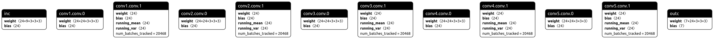
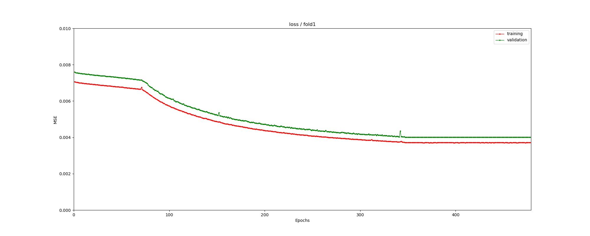
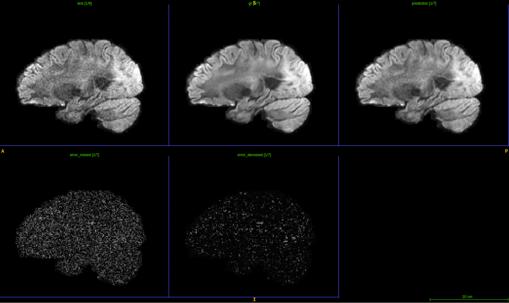

A Tool for DWIs Denoising

1. Introduction

Author: Jinnan Hu

Instructor: Dr. junyan Wang

From Computer Neural Imaging Research Group, Zhejiang Lab

2. Acknowledgement

Our model is a small version of [DeepDTI](https://doi.org/10.1016/j.neuroimage.2020.117017), trained by NVIDIA 3090 24G.

The main difference between our implementation and DeepDTI is that we trained the network using complete volumes instead of blocks. 
Thus, our network is smaller due to the limited GPU memory.

See detailed elaborations from the paper 'DeepDTI: High-fidelity six-direction diffusion tensor imaging using deep learning'

Functions:

a) Provide a well-trained model to denoise the dMRIs.

b) A test script to evaluate the performance.

c) A train script to build your model.

Environment:

python 3.6 + pytorch 1.8.1 + cuda11.1

See detailed info in requirements.txt, use command <pip install -r requirements.txt> to install the packages.

2. Usage

a) Download the well-trained model from our drive.

b) Download HCP database (about 60MB for one sample) from our drive (or in https://db.humanconnectome.org), or prepare your own database.
Mind your database should contain b=0 volumes/ T1 weighted volume and T2 weighted volume. (Please download to 'test/')

Google drive: https://drive.google.com/drive/folders/1yxek_TaBvl-g3Dsuj6DUewEWEqkKJfju?usp=sharing

c) Prepare your environment, see requirement.txt.

d) Get your own database in train directory and validate directory, then run train.py. See more info by the command: pyhton train.py -h

e) Run test.py -n [sample name] to obtain predicted volumes and evaluation outcomes using the well-trained model.

3. Presentation

The small version of DeepDTI network:

Training process:

Denoise data: the predicted data is in 'test/sample_name/prediction/'

Visual outcome obtained by [itksnap](http://www.itksnap.org/pmwiki/pmwiki.php).

Please feel free to contact us if you have any problem.

[Contact us](jinnanhu@zhejianglab.com)

