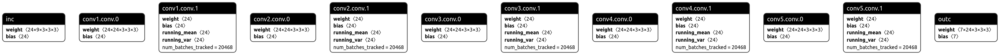
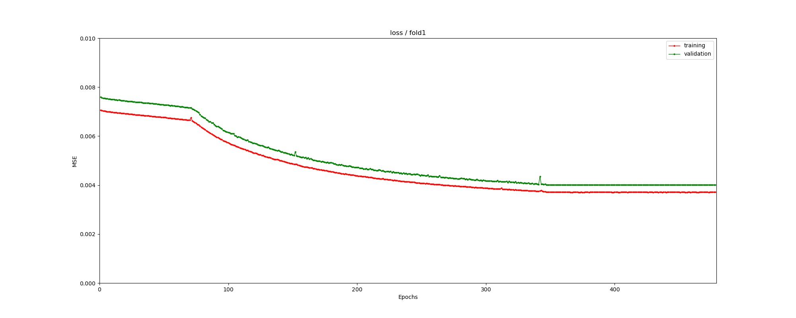
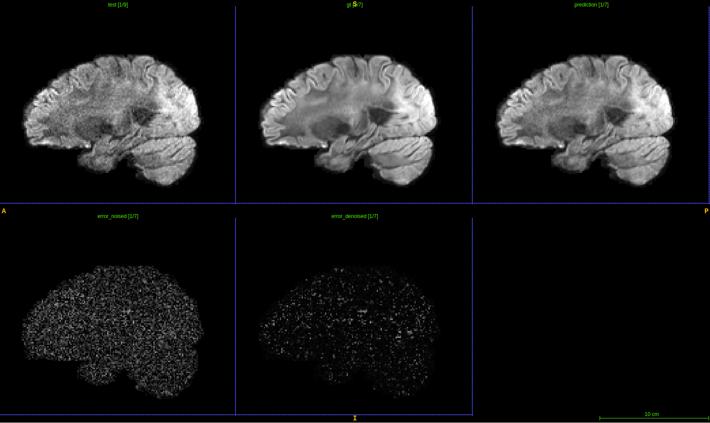

DeepDTI reimplimentation (simplified)

1. Functions

  a) Provide a trained model to denoise the dMRIs.

  b) A test script to evaluate the performance.

  c) A train script to build your model.

2. Environment

  python 3.6 + pytorch 1.8.1 + cuda11.1

  See detailed info in requirements.txt, use command <pip install -r requirements.txt> to install the packages.

3. Usage

  a) Download the well-trained model from our drive.

  b) Download HCP database (about 60MB for one sample) from our drive (or in https://db.humanconnectome.org), or prepare your own database.
Mind your database should contain b=0 volumes/ T1 weighted volume and T2 weighted volume. (Please download to 'test/')

  Google drive: https://drive.google.com/drive/folders/1yxek_TaBvl-g3Dsuj6DUewEWEqkKJfju?usp=sharing

  c) pip install -r requirements.txt

  d) Get your own database in train directory and validate directory, then run train.py. See more info by the command: pyhton train.py -h

  e) Run test.py -n [sample name] to obtain predicted volumes and evaluation outcomes using the well-trained model.

4. Example

  The small version of DeepDTI network:

  Training process:

  Denoise data: the predicted data is in 'test/sample_name/prediction/'

  
  Visual outcome obtained by [itksnap](http://www.itksnap.org/pmwiki/pmwiki.php).

  

Please feel free to contact us if you have any problem.

[Contact us](jinnanhu@zhejianglab.com)
  
Q. Tian, B. Bilgic, Q. Fan, et al. "DeepDTI: high-fidelity six-direction diffusion tensor imaging using deep learning Neuroimage", 219 (2020), Article 117017
